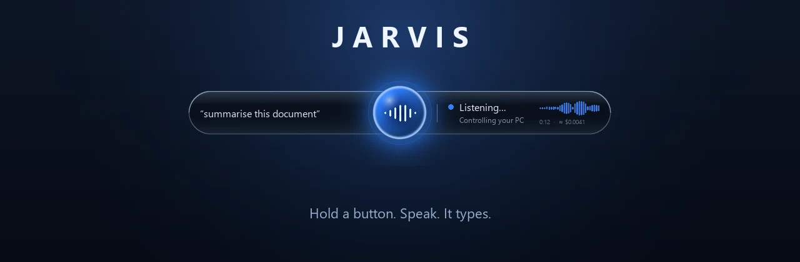
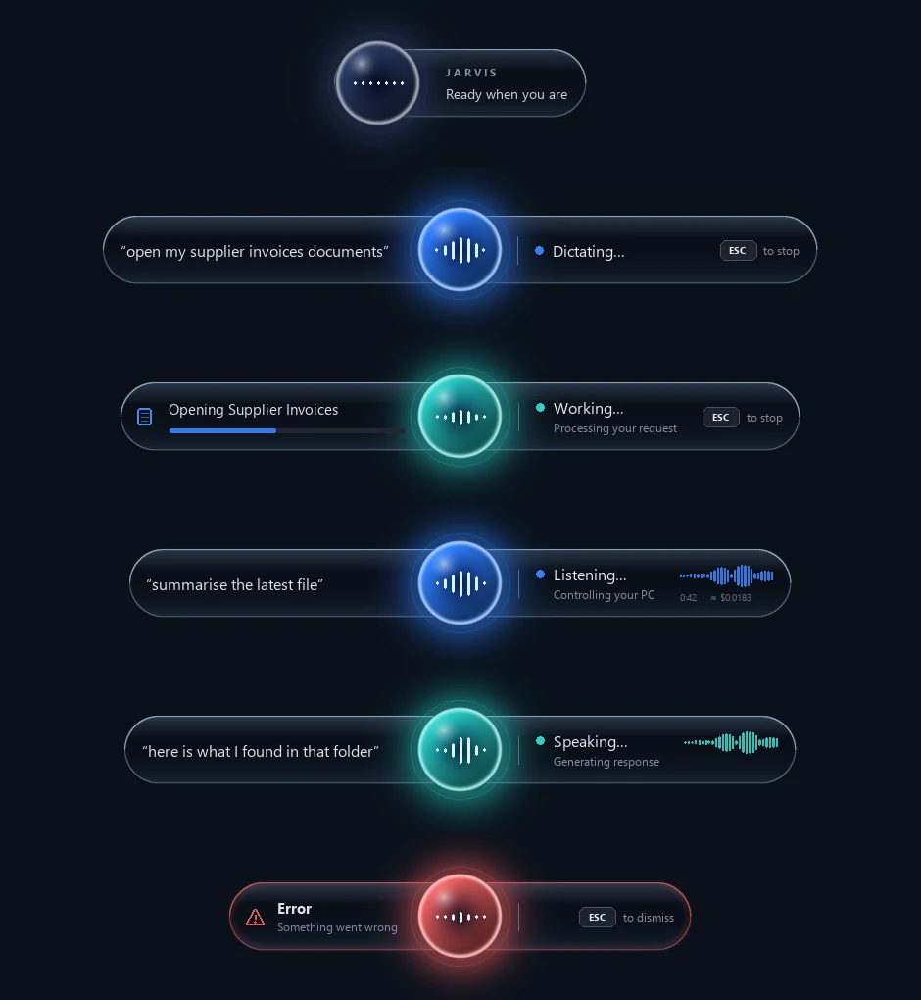
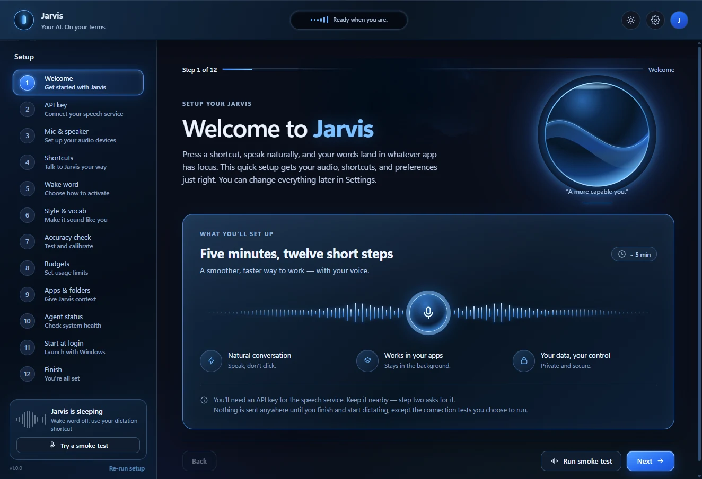
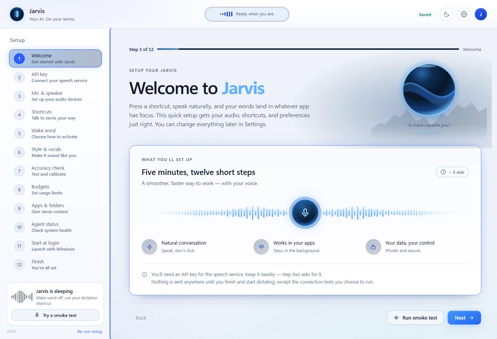

<div align="center">



# Jarvis

**Fale com o seu PC. Ele escuta, responde e digita por você.**

Segure uma tecla, fale, solte — suas palavras aparecem no cursor, em qualquer
aplicativo em foco. Ou abra uma conversa por voz que realmente *faz coisas*:
pesquisar na web, abrir seus aplicativos, executar tarefas na sua máquina.

Sem assinatura. Use sua própria chave da OpenAI. **A partir de $0.0045 por
minuto.**

[](LICENSE)
[](pyproject.toml)
[](#platform-support)
[](CONTRIBUTING.md)
[](#speaks-your-language)

**Leia em:** [English](README.md) · [Español](README.es.md) · [Français](README.fr.md) · [Deutsch](README.de.md) · **Português (BR)** · [简体中文](README.zh-CN.md) · [日本語](README.ja.md)

</div>

---

## Veja funcionando

[](docs/media/jarvis-demo.mp4)

**▶ Assista à demonstração de 81 segundos com som** · 1080p, 11 MB

---

## Por quê

Você pensa mais rápido do que digita. E se repete o dia inteiro: o mesmo tipo de
e-mail, a mesma mensagem de commit, o mesmo pedido de "resuma este documento".

Ferramentas de ditado resolvem metade disso, e são ou uma assinatura, ou um
brinquedo, ou apertam Enter sem avisar e enviam sua mensagem pela metade.

O Jarvis faz as duas metades, custa centavos e fica fora do caminho. Não tem
assinatura, nem conta, nem telemetria, nem servidor próprio.

<table>
<tr>
<td width="50%">

**Você fala, e está digitado**
> *"Oi, Sarah — sobre a fatura de terça: você pode confirmar o número do pedido
> para eu conseguir processar isso hoje?"*

…chega no seu e-mail, no seu editor, no seu chamado, onde quer que o cursor
esteja.

</td>
<td width="50%">

**Ou peça alguma coisa**
> *"Jarvis, qual é a última novidade do lançamento do Vue 3.6?"*

…ele pesquisa e responde em voz alta, numa conversa em que você pode falar por
cima.

</td>
</tr>
</table>

## Capturas de tela

<div align="center">



<sub>A pílula nos seis estados — ocioso, ditando, trabalhando, ouvindo, falando,
erro. Ela nunca rouba o foco e fica ociosa quando nada está acontecendo.</sub>

<br><br>



<sub>Configuração em doze passos: ele verifica seu microfone, seus alto-falantes,
seus atalhos e sua chave antes de você depender dele.</sub>

<br><br>



<sub>Toda tela tem tema claro, e a interface inteira é traduzida — veja abaixo.</sub>

</div>

## Instalação

**Windows 10 ou 11.** Você precisa do Python 3.11+ e de uma chave de API da
OpenAI.

```bat
git clone https://github.com/RizN91/jarvis.git
cd jarvis
setup.cmd
```

O `setup.cmd` encontra um Python adequado, cria um ambiente virtual, instala as
dependências fixadas e roda uma verificação rápida. Depois:

```bat
run.cmd
```

O primeiro uso abre o assistente de configuração. Ele conduz você por microfone,
alto-falantes, atalhos, palavra de ativação e orçamento, e pede sua chave de API —
que fica guardada no **Gerenciador de Credenciais do Windows**, nunca em um
arquivo.

Nada é enviado a lugar nenhum até você concluir o assistente e começar a ditar,
exceto os testes de conexão que você escolher rodar.

Prefere fazer na mão?

```bat
py -3.11 -m venv .venv
.venv\Scripts\python.exe -m pip install -r requirements.txt
.venv\Scripts\python.exe -m jarvis
```

## Quanto custa

Você usa sua própria chave da OpenAI, então paga direto para a OpenAI: sem
acréscimo, sem assinatura, sem licença por usuário. Dois motores, e a escolha é
sua:

| Motor | Modelo | Custo | Parece |
| --- | --- | --- | --- |
| **Economy** *(padrão para ditado)* | `gpt-transcribe` | **$0.0045 / min** | cerca de **27 horas por dólar**; o mais preciso para texto literal |
| **Live** | `gpt-live-1` | **$0.05 / min** | cerca de 20 minutos por dólar; conversacional, lida com interrupções e turnos |

Para dar escala: **vinte minutos de ditado por dia, cinco dias por semana, custam
cerca de 45 centavos por mês** no Economy. O assistente é a parte cara, e só
enquanto você está realmente falando com ele.

O Jarvis também mede o próprio gasto e para nos tetos diários e mensais que você
definir. Esses tetos são contadores do próprio Jarvis — ele não consegue ler o
orçamento da sua conta OpenAI, e nunca diz que consegue.

## Recursos

**Ditado**
- Digita em **qualquer** aplicativo — editores, navegadores, chats, terminais,
  sistemas de chamados.
- **Nunca aperta Enter**, então não tem como enviar uma mensagem pela metade.
- Recusa campos de senha; em terminais, segura o texto para revisão em vez de
  digitar automaticamente dentro de um shell.
- Seu próprio **vocabulário** — nomes, jargão, nomes de produtos — enviado ao
  transcritor como dicas, o que melhora a precisão de forma mensurável.
- Desfazer que não engole o que você mesmo digitou.

**Assistente de voz**
- `Ctrl+Alt+Space` abre uma conversa com interrupção de verdade — fale por cima e
  ele para.
- Ele pesquisa na web e age na sua máquina por uma camada de ferramentas em que
  toda ação exige **seu Sim explícito**, com os argumentos exatos à mostra.
- Agentes de código locais (Codex, Claude Code) podem receber tarefas longas, e o
  Jarvis informa qual deles usou.

**Sempre**
- **Palavras de ativação locais** — "Hey Jarvis", "Hey GPT". Rodam na sua máquina
  (`sherpa-onnx`); **nenhum áudio sai do dispositivo enquanto ele escuta** a frase
  de ativação.
- **A pílula.** Uma sobreposição flutuante com alfa por pixel que mostra o que ele
  ouviu e o que está fazendo, e que realmente deixa os cliques passarem sem
  ativar a janela.
- **Privacidade por construção** — sem telemetria, sem banco de dados na nuvem,
  sem analytics, sem conta. O áudio bruto não é armazenado.
- Temas claro e escuro. Suporte a movimento reduzido.

## Fala o seu idioma

Toda a configuração inicial e a interface de ajustes vêm em **15 idiomas**, com um
seletor em Ajustes:

`English` · `Español` · `Français` · `Deutsch` · `Italiano` · `Nederlands` ·
`Polski` · `Português (BR)` · `Русский` · `Türkçe` · `العربية` (RTL) ·
`हिन्दी` · `中文 (简体)` · `日本語` · `한국어`

Seu idioma é detectado do sistema no primeiro uso. Faltou algum? É um arquivo e um
pull request — veja [CONTRIBUTING.md](CONTRIBUTING.md).

## Suporte de plataforma

**Windows 10 e 11 são totalmente suportados.** O núcleo é construído sobre Win32 —
hooks globais de entrada, inserção de texto via `SendInput`, janelas em camadas
para a pílula, DPAPI para a chave, WTS para detectar bloqueio e suspensão. É isso
que faz ele parecer nativo, e também é por isso que ainda não é portável.

**macOS e Linux ainda não são suportados.** Rodar por lá encerra com uma mensagem
clara em vez de um traceback. Um port está no roteiro; é um projeto de verdade,
não uma flag.

## Roteiro

O que vem por aí, mais ou menos em ordem:

- [ ] **Mais modelos, não só OpenAI** — Claude e Gemini como cérebro do
      assistente, e modelos locais via Ollama para um modo totalmente offline.
- [ ] **Vozes melhores** e um seletor de voz, incluindo seu próprio perfil de voz.
- [ ] **Temas e skins** — mais do que claro/escuro, e uma pílula que combine com
      sua área de trabalho.
- [ ] **Ditado realmente em streaming** — hoje o Live grava e depois reproduz, então
      o tempo entre soltar e ver o resultado inclui a duração do que você falou.
- [ ] **Port para macOS** (Accessibility API + Quartz) e **Linux** (X11).
- [ ] **Plugins** — deixar as pessoas adicionarem seus próprios comandos falados e
      ferramentas.
- [ ] **Um instalador assinado**, para o SmartScreen parar de avisar.

Ideias, votos e reclamações são bem-vindos nas
[Issues](https://github.com/RizN91/jarvis/issues) — o roteiro segue o que as
pessoas realmente pedem.

## Como funciona

Uma versão curta; o detalhe de verdade está em [ARCHITECTURE.md](ARCHITECTURE.md).

- Um processo mínimo na bandeja é dono dos hooks globais, do áudio e da pílula.
  Em repouso fica em **2 processos, ~53 MB e ~0,3 % de um núcleo**.
- A janela de ajustes é um processo **separado**, então o WebView2 (~440 MB) só
  existe enquanto você a mantém aberta.
- A fala vai direto para a OpenAI por WebSocket. **Não existe servidor do Jarvis
  nem porta em localhost** — nada para atacar, nada para sair do ar.
- Seus dados (histórico, vocabulário, gasto) são SQLite no seu próprio disco.
  Nada é sincronizado em lugar nenhum.

## Segurança e privacidade

- Sua chave de API fica guardada **apenas** no Gerenciador de Credenciais do
  Windows, protegida por DPAPI, e nunca é escrita em arquivo de configuração,
  banco de dados, log, linha de comando ou na interface.
- Um filtro de redação remove strings com formato de chave de todo registro de
  log.
- **Sem telemetria. Sem analytics. Sem conta.**
- O áudio bruto não é gravado em disco.
- Iniciar junto com o login é opcional e reversível; a desinstalação remove tudo.

Veja [SECURITY.md](SECURITY.md) para saber como relatar uma vulnerabilidade.

## Como contribuir

Relatos de bug, traduções, temas e novos verbos de ferramentas são todos
bem-vindos — comece por [CONTRIBUTING.md](CONTRIBUTING.md). Ele explica as suítes
de teste, como adicionar um idioma e o punhado de regras que já evitaram bugs
reais (nada de segredos em logs, nunca sintetizar Enter, nunca deixar o texto
ditado virar instruções).

A suíte de testes tem ~486 asserções em 13 suítes gratuitas, e digita em
aplicativos reais em vez de mocks. Há muito o que construir se você quiser ajudar.

## Licença

[MIT](LICENSE) Dependency and model licences: [THIRD-PARTY-NOTICES.md](THIRD-PARTY-NOTICES.md). — faça o que quiser com ele.

O Jarvis não é afiliado, endossado nem patrocinado pela OpenAI. Você fornece sua
própria chave de API e é responsável pelo seu uso.

---

<div align="center">

**Se o Jarvis economiza seu tempo, uma ⭐ ajuda outras pessoas a encontrá-lo.**

</div>
